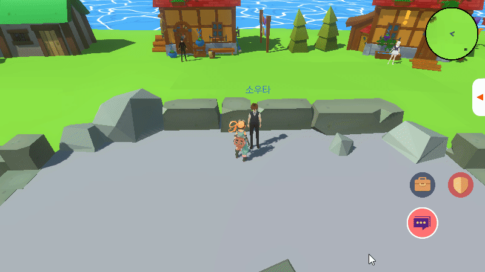
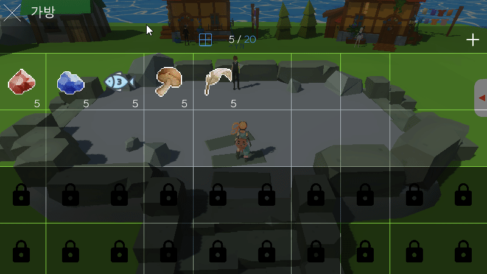
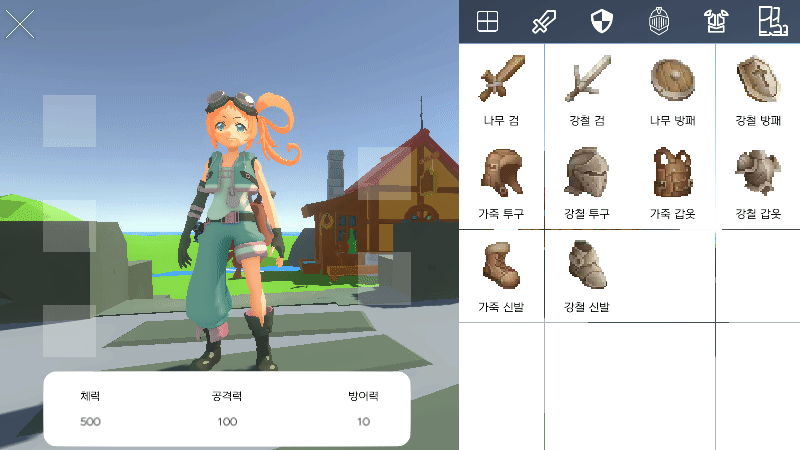
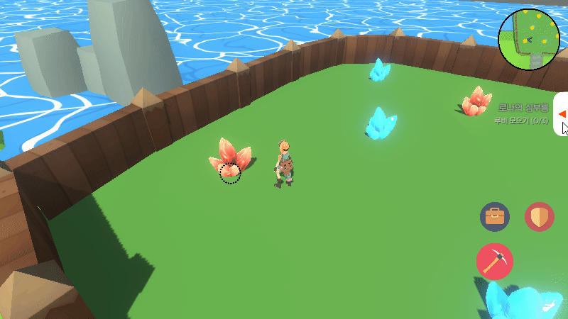
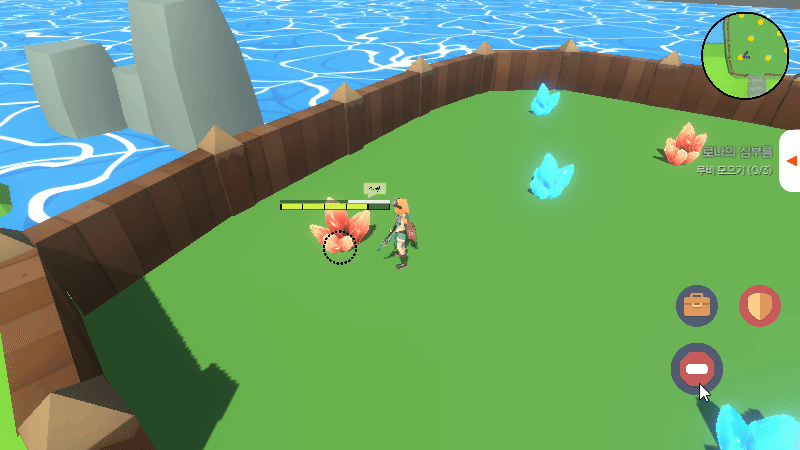
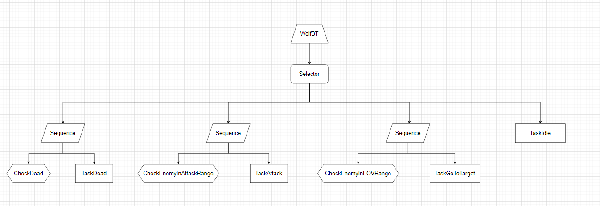

# Unity_Portfolio

테스트 문구
# 구현된 기능
 

## 대화

 
 

## 아이템 인벤토리

 
 

## 장비 인벤토리
 

### 장착 / 해제

 

### 정렬

 
 

## 채집 기능

광석 채굴

 

낚시

 

채집

 
 

## 퀘스트

퀘스트 UI

 

퀘스트 진행도

 

 

## Behaviour 트리를 이용한 AI 구현

 
 

## 전투

