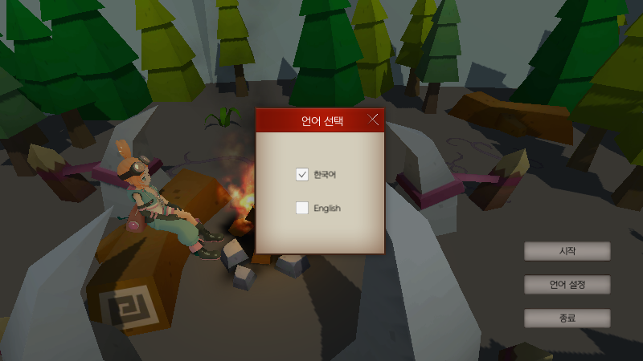

# Unity_Portfolio

  

## 프로젝트 소개

Unity 엔진으로 제작된 RPG 게임 포트폴리오입니다.
 
PC와 모바일에서 

## 프로젝트 개요

- 개발언어 : c#

- 개발도구 : Unity 

- 플랫폼 : 안드로이드, PC

 
 

## 링크
영상 (기능) : https://youtu.be/abKHZa3Ivpo
 
영상 (플레이 영상) : https://youtu.be/OaDpxv8fKhE
 
기술서 :

 
 

## 구현된 기능
<!-- - [다중언어 지원](https://github.com/mintchobab/Unity_Portfolio/blob/main/contents/language/language.md)
- [대화](https://github.com/mintchobab/Unity_Portfolio/blob/main/contents/talk/talk.md)
- [아이템 인벤토리](https://github.com/mintchobab/Unity_Portfolio/tree/main/contents/inventory_item/inventory_item.md)
- [장비 인벤토리](https://github.com/mintchobab/Unity_Portfolio/tree/main/contents/inventory_equip/inventory_equip.md)
- [채집](https://github.com/mintchobab/Unity_Portfolio/blob/main/contents/collect/collect.md)
- [퀘스트](https://github.com/mintchobab/Unity_Portfolio/blob/main/contents/quest/quest.md)
- [전투](https://github.com/mintchobab/Unity_Portfolio/blob/main/contents/combat/combat.md)
- [해상도 대응](https://github.com/mintchobab/Unity_Portfolio/blob/main/contents/resolution/resolution.md) -->

 
- [다중 언어 지원](#다중-언어-지원) <!-- omit in toc -->
  <!-- - [json](#json)
  - [언어 선택](#언어-선택) -->
- [대화](#대화)
  <!-- - [대화 시작](#대화-시작)
  - [대화 진행](#대화-진행) -->
- [아이템 인벤토리](#아이템-인벤토리)
  <!-- - [아이템 획득](#아이템-획득)
  - [아이템 사용](#아이템-사용)
  - [인벤토리 확장](#인벤토리-확장) -->
- [장비 인벤토리](#장비-인벤토리)
  <!-- - [정렬](#정렬)
  - [장착](#장비-장착)
  - [해제](#장비-해제)
  - [스텟 적용](#스텟-적용) -->
- [채집](#채집)
  <!-- - [채집 시작](#채집-시작)
  - [채직 진행](#채집-진행)
  - [채집 종류](#채집-종류) -->
- [퀘스트](#퀘스트)
  <!-- - [퀘스트 수락](#퀘스트-수락)
  - [퀘스트 확인](#퀘스트-확인)
  - [퀘스트 진행](#퀘스트-진행) -->
- [전투](#전투)
  <!-- - [플레이어의 공격](#플레이어의-공격)
  - [몬스터 AI](#몬스터-ai)
  - [보스 몬스터](#보스-몬스터) -->
- [해상도 대응](#해상도-대응)

 
 

## 다중 언어 지원

 

### json

 

json 파일에 저장된 데이터에 따라 게임내 텍스트들의 언어를 변경할 수 있다.
 
현재 한국어와 영어 두 가지 언어만 저장되어 있지만, 추가하고자 하는 언어의 문장들만 입력하면 적용이 가능하다.

 
 
 
 

### 언어 선택

 

언어 변경은 게임 중에는 불가능하고, 시작 화면에서만 선택할 수 있다.

 
 
 
 

한국어와 영어 비교

   

   

 
 
 
 

## 대화

 

### 대화 시작

 

NPC의 근처로 이동하면 버튼의 이미지가 대화 모양으로 변경된다.
 
버튼을 클릭하면 자동으로 NPC 근처로 이동하고 일정거리만큼 가까워지면 대화가 시작된다.

 
 
 
 

### 대화 진행

 

대화창은 타이핑되는 것처럼 문장이 출력되고 화면을 클릭하면 다음 대화문이 출력된다.
 
대화문이 출력되는 도중에 화면을 클릭하면 해당 대화문의 끝까지 한번에 출력된다.

 
 
 
 

## 아이템 인벤토리

 

### 아이템 획득

 

아이템을 획득하면 순서대로 인벤토리에 저장된다.

 
 
 
 

아이템마다 최대 개수가 존재하고, 개수를 초과하게 되면 새로운 슬롯에 생성된다.

 
 
 
 

### 아이템 사용

 

아이템을 클릭하면 팝업창이 활성화 되고 해당 아이템에 대한 정보가 출력된다.

 
 
 
 

아이템 사용 가능 여부에 따라 팝업창의 버튼이 활성화 / 비활성화 된다.

   

 
 
 
 

### 인벤토리 확장

 

'+' 버튼을 누르면 최대 50칸까지 인벤토리를 확장할 수 있다.

 
 
 
 

## 장비 인벤토리

 

### 정렬

 

탭 버튼을 클릭하면 해당 장비가 인벤토리에 앞쪽으로 오게 정렬된다. (같은 종류끼리는 아이템의 ID 순서에 따라 정렬)

 
 
 
 

### 장비 장착

 

장비를 클릭하면 해당 장비를 설명하는 팝업창이 나오고 장착 버튼을 누르면 부위에 맞게 자동으로 장착된다.

 
 
 
 

### 장비 해제

 

장착된 장비를 클릭하면 장비를 해제할 수 있다.

 
 
 
 

### 스텟 적용

 

장비가 장착되거나 해제됨에 따라 플레이어의 스텟이 변경된다.

 
 
 
 

## 채집

 

### 채집 시작

 

채집물 근처로 이동하면 버튼의 이미지가 변경된다.
 
버튼을 클릭하면 자동으로 채집물 근처로 이동하고 일정거리만큼 가까워지면 채집이 시작된다.

 
 
 
 

### 채집 진행

 

채집이 시작되면 게이지가 나타난다. 노란색 게이지가 가득 차면 채집이 종료되고 해당 아이템을 획득한다.

 
 

노란색 게이지는 일정 확률에 따라 한칸씩 채워진다.
 
흰색 게이지는 시간을 나타내고 흰색 게이지가 전부 줄어들 때까지 노란색 게이지가 채워지지 못하면 실패하게 된다.

 
 
 
 

### 채집 종류

 

채광

 

낚시

 

수색

 
 
 
 

## 퀘스트

 

### 퀘스트 수락

 

머리 위에 느낌표가 있는 NPC에게 퀘스트를 받을 수 있다.

 
 

대화 마지막에 수락 / 취소 버튼이 활성화 되는데, 수락 버튼을 누르면 퀘스트가 받아진다.

 
 
 
 
 

### 퀘스트 확인

 

진행중인 퀘스트는 화면 우측 버튼을 클릭해서 확인할 수 있다.

 
 
 
 

### 퀘스트 진행

 

퀘스트 아이템을 획득하거나 몬스터를 사냥했을 때 화면 위쪽에 현재 퀘스트 진행도가 표시된다.

 
 
 
 

## 전투

 

### 플레이어의 공격

 

플레이어는 일반 공격과 스킬 공격을 할 수 있다.
 
버튼을 클릭하면 공격을 실행할 수 있고, 각각의 공격은 개별 쿨타임을 가지고 있다.

 
 
 
 

### 몬스터 AI

 

몬스터는 Behaviour Tree에 기반하여 동작을 한다.

 
 
 
 

플레이어가 멀어지면 추적을 하고 가까워지면 공격을 시작한다.

 
 
 
 

### 보스 몬스터

 

보스 몬스터의 AI는 일반 늑대와 동일하지만 근접 공격뿐만 아니라 범위 공격도 사용한다.

 
 
 
 

## 해상도 대응

### 16:9 vs 18.5:9

 

 
 

 
 

