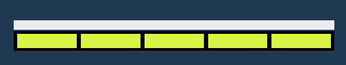

# 채집

- [채집 시작](#채집-시작) <!-- omit in toc -->
- [채집 진행](#채집-진행)
- [채집 종류](#채집-종류)

 

## 채집 시작

채집물 근처로 이동하면 버튼의 이미지가 변경된다.
 
버튼을 클릭하면 자동으로 채집물 근처로 이동하고 일정거리만큼 가까워지면 채집이 시작된다.

 
 
 
 

## 채집 진행

 

채집이 시작되면 게이지가 나타난다. 노란색 게이지가 가득 차면 채집이 종료되고 해당 아이템을 획득한다.

 
 

노란색 게이지는 일정 확률에 따라 한칸씩 채워진다.
 
흰색 게이지는 시간을 나타내고 흰색 게이지가 전부 줄어들 때까지 노란색 게이지가 채워지지 못하면 실패하게 된다.

 
 
 
 

## 채집 종류

 

채광

 

낚시

 

수색

