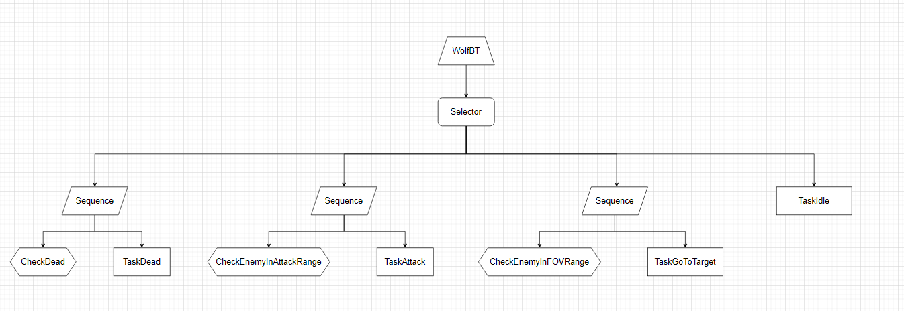
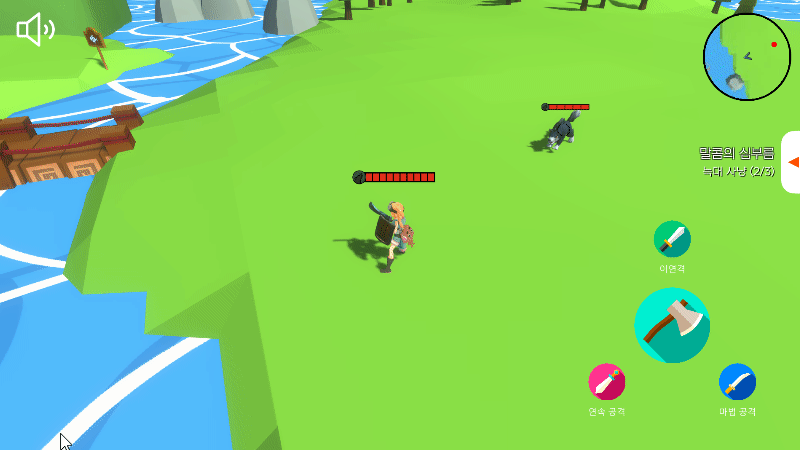

## 전투

- [플레이어의 공격](#플레이어의-공격) <!-- omit in toc -->
- [몬스터 AI](#몬스터-ai)
- [보스 몬스터](#보스-몬스터)

 

## 플레이어의 공격

 

플레이어는 일반 공격과 스킬 공격을 할 수 있다.
 
버튼을 클릭하면 공격을 실행할 수 있고, 각각의 공격은 개별 쿨타임을 가지고 있다.

 
 
 
 

## 몬스터 AI

 

몬스터는 Behaviour Tree에 기반하여 동작을 한다.

 
 
 
 

플레이어가 멀어지면 추적을 하고 가까워지면 공격을 시작한다.

 
 
 
 

## 보스 몬스터

 

보스 몬스터의 AI는 일반 늑대와 동일하지만 근접 공격뿐만 아니라 범위 공격도 사용한다.

