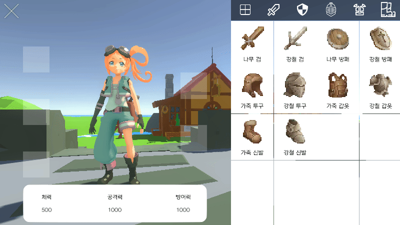
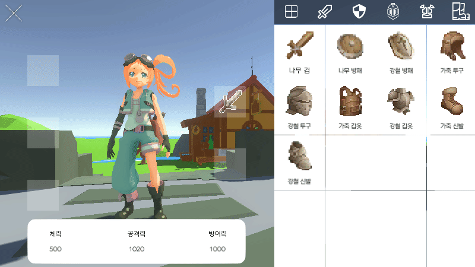
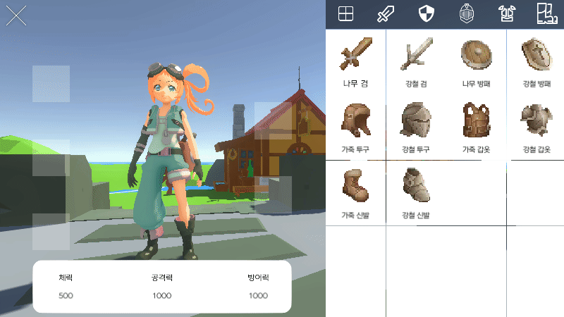

# 장비 인벤토리

- [정렬](#정렬) <!-- omit in toc -->
- [장착](#장비-장착)
- [해제](#장비-해제)
- [스텟 적용](#스텟-적용)
    

 

## 정렬

 

탭 버튼을 클릭하면 해당 장비가 인벤토리에 앞쪽으로 오게 정렬된다. (같은 종류끼리는 아이템의 ID 순서에 따라 정렬)

 
 
 
 

## 장비 장착

 

장비를 클릭하면 해당 장비를 설명하는 팝업창이 나오고 장착 버튼을 누르면 부위에 맞게 자동으로 장착된다.

 
 
 
 

## 장비 해제

 

장착된 장비를 클릭하면 장비를 해제할 수 있다.

 
 
 
 

## 스텟 적용

 

장비가 장착되거나 해제됨에 따라 플레이어의 스텟이 변경된다.

