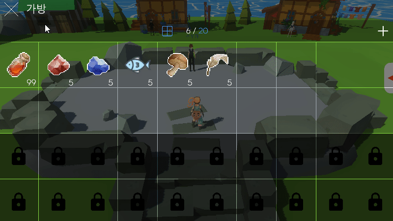

# 아이템 인벤토리

- [아이템 획득](#아이템-획득) <!-- omit in toc -->
- [아이템 사용](#아이템-사용)
- [인벤토리 확장](#인벤토리-확장)

 

## 아이템 획득

 

아이템을 획득하면 순서대로 인벤토리에 저장된다.

 
 
 
 

아이템마다 최대 개수가 존재하고, 개수를 초과하게 되면 새로운 슬롯에 생성된다.

 
 
 
 

## 아이템 사용

 

아이템을 클릭하면 팝업창이 활성화 되고 해당 아이템에 대한 정보가 출력된다.

 
 
 
 

아이템 사용 가능 여부에 따라 팝업창의 버튼이 활성화 / 비활성화 된다.

   

 
 
 
 

## 인벤토리 확장

 

'+' 버튼을 누르면 최대 50칸까지 인벤토리를 확장할 수 있다.

