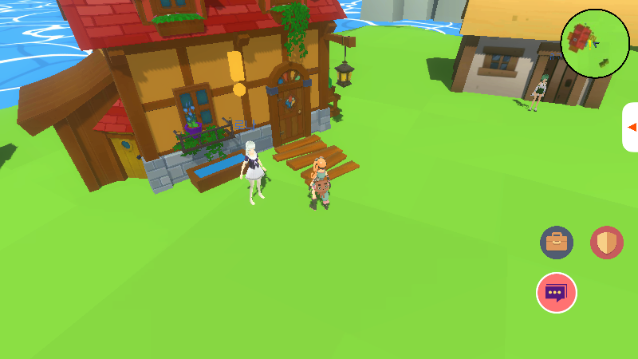
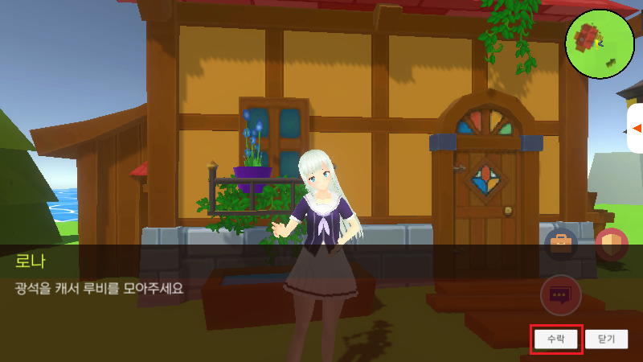
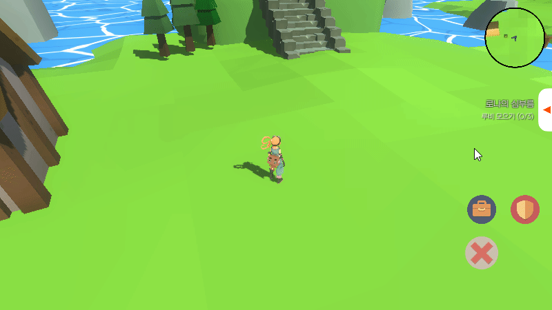
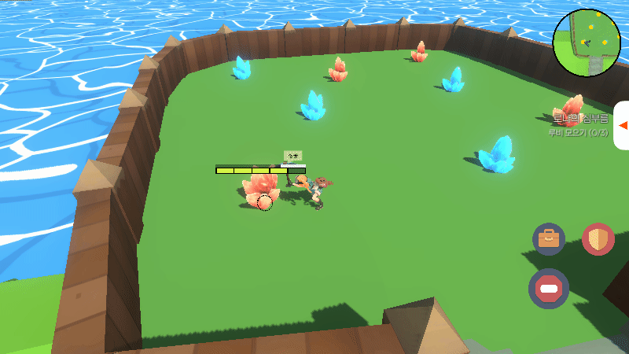

# 퀘스트

- [퀘스트 수락](#퀘스트-수락) <!-- omit in toc -->
- [퀘스트 확인](#퀘스트-확인)
- [퀘스트 진행](#퀘스트-진행)

 

## 퀘스트 수락

 

머리 위에 느낌표가 있는 NPC에게 퀘스트를 받을 수 있다.

 
 

대화 마지막에 수락 / 취소 버튼이 활성화 되는데, 수락 버튼을 누르면 퀘스트가 받아진다.

 
 
 
 
 

## 퀘스트 확인

 

진행중인 퀘스트는 화면 우측 버튼을 클릭해서 확인할 수 있다.

 
 
 
 

## 퀘스트 진행

 

퀘스트 아이템을 획득하거나 몬스터를 사냥했을 때 화면 위쪽에 현재 퀘스트 진행도가 표시된다.

