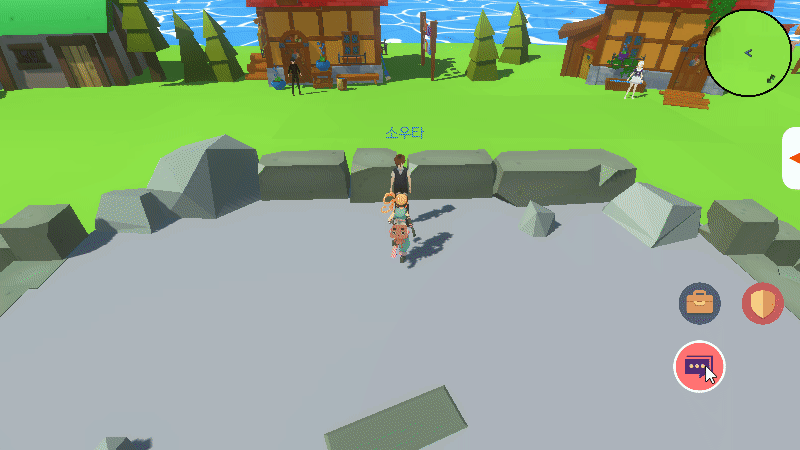

# 대화

- [대화 시작](#대화-시작) <!-- omit in toc -->
- [대화 진행](#대화-진행)

 

## 대화 시작

 

NPC의 근처로 이동하면 버튼의 이미지가 대화 모양으로 변경된다.
 
버튼을 클릭하면 자동으로 NPC 근처로 이동하고 일정거리만큼 가까워지면 대화가 시작된다.

 
 
 
 

## 대화 진행

 

대화창은 타이핑되는 것처럼 문장이 출력되고 화면을 클릭하면 다음 대화문이 출력된다.
 
대화문이 출력되는 도중에 화면을 클릭하면 해당 대화문의 끝까지 한번에 출력된다.

